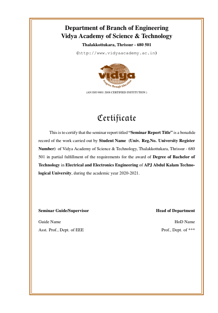

# B.Tech - Seminar Report
#### Template - VAST
###### <i> developed by Asst.Prof Arun Xavier</i>

### Screenshots
 

#### Steps to Make this Report:
- Clone this Repository or Download the Zip [Here](https://github.com/elvistony/btech-seminar-template/archive/main.zip "Seminar Template")
- Download a Latex Editing Software, I use [TexStudio](https://www.texstudio.org/) 
  - Linux Installation `sudo apt-get install texstudio`
- Download Support Package Ps-tricks Package for Tex.
  - Linux Installation `sudo apt-get texlive-pstricks`
  - Windows Installation (not exactly sure how!) ~ make a PR if you Do!
- Open `SeminarReport.tex` in TexStudio and Press the Green ▶️
- If it Compiled Successfully, You'll see message in the console as:
   
        Process started: pdflatex -synctex=1 -interaction=nonstopmode "SeminarReport".tex
        Process exited normally

- Edit the file `SeminarReport.tex` and Hit the Play Button to Compile.
- The [PDF](SeminarReport.pdf) will be generated in the same Folder.

#### FAQ

- The PDF generated has the borders misplaced and fonts are inaccurate.
  - This maybe because the Editor you're using is compiling the Tex file using a Compiler other than `pdfLatex`
    Use `pdflatex` as your compiler and it should be fine.

- I see errors in the Console and the PDF is not Generating.
  - This maybe because you accidentally deleted some Tex Syntax. Try Undo-ing till it Compiles and note, where you might have gone wrong.

#### Documented By
Elvis

